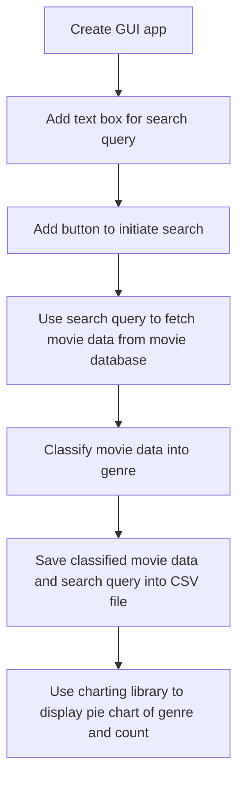
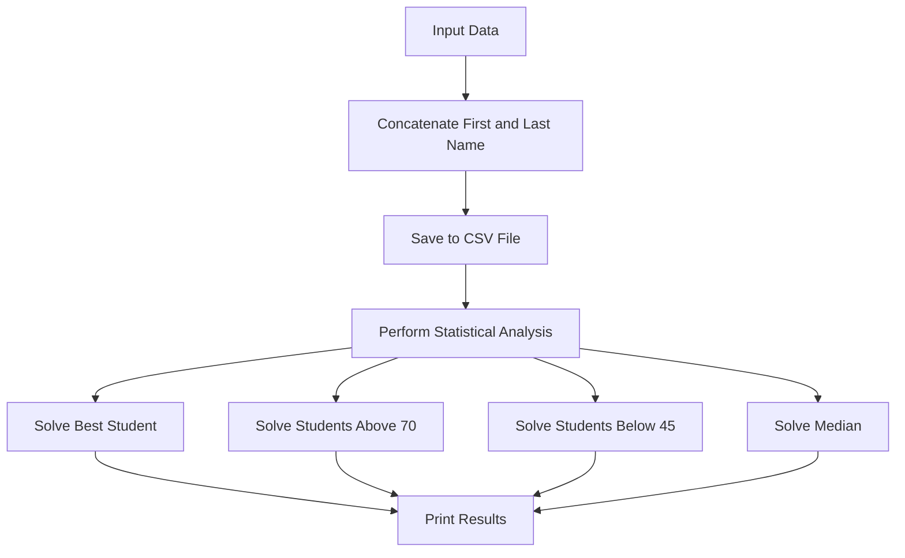

# GUI Apps

| Project | Description |
|---------|-------------|
| Movie Genre Scraper and EDA | Scrapes genre data for movies from a movie database, and performs an exploratory data analysis on the data. |
| School Data EDA | Takes in student names, matric numbers, and scores, and performs an exploratory data analysis on the figures. |

## Movie Genre Scraper and EDA
### Problem Statement

A new film producer is planning to venture into producing a YouTube movie that is likely attract more subscribers to his YouTube channel. As his Software consultant, you have been mandated to develop an application that can search the movies on YouTube and classifies the movies into various genre. The application should show a pie chart of the genre classification.

### Problem Specification
Build a GUI Windows application that accepts an input mainly “Search Query”. The query is used to fetch movies from a movie database using an API, the result is used to classify the movies into genre. The result and the query are saved into a CSV file, so that later exploratory data analysis can be done on the result. The GUI application should be able to show a pie chart of genre and video/result counts.


| Topic          | Description                                                                                                                                              |
|----------------|--------------------------------------------------------------------------------------------------------------------------------------------------------|
| Project Type   | Data Analysis App                                                                                                                                       |
| Problem Type   | Information gathering from web scraping to perform exploratory data analysis.                                                                    |
| OS Specification | Windows operating system for its best support and user-friendliness.                                                                                           |
| Programming Language | Python                                                                                                                                           |
| Use Case       | Film Producers, Youtube Creators etc                                                                                                            |
| Accepts Inputs | Yes, mainly search query.                                                                                                                     |
| Store Data     | Yes, uses CSV (Comma-Separated Values)                                                                                                         |
| Libraries      | Tkinter, csv, pandas, bs4, matplotlib.pyplot                                                                                                   |
| Goal           | The goal of the app is to save data on most performing genre/category base on search query from a user to perform easy analysis for youtubers and film producers. |


### Requirements

For this project, we'll need an application that can do the following:
- Accepts inputs from users mainly search query
- Fetch a response from a database using an API with the query above
- Get count and genre and categories from the response
- Have validation on the type of inputs to be accepted
- Clear the inputs after storing them
- Store imputed data on the harddrive using (csv/xlsx)
- Show analysis data which includes genres, and count in a pie chart.

### Design:

To solve this problem, we can follow the following algorithm:

- Create a GUI application using Tkinter in Python.
- Add a text box for the user to enter the search query and a button to initiate the search.
- Use the search query to fetch movie data from the movie database (IMDB) using an API.
- Classify the movie data into genre.
- Save the classified movie data and the search query into a CSV file with Columns (Genre & Count)
- Use a charting library, such as Matplotlib, to display a pie chart of the genre and the corresponding count of movies in each genre.

Step-by-step procedures:

The MovieSearcher class has the following attributes and methods:

Attributes:
- OMDB_API_URL: a string representing the URL of the OMDB API
- API_KEY: a string representing the API key to use with the OMDB API

Methods:
- __init__: initializes the class and sets up the GUI elements, such as text boxes, labels, and buttons.
- searchMovie: searches for movies using the search query entered by the user. It uses the OMDB API to fetch the movie data and then classifies the movies into genre. The classified movie data and the search query are then saved into a CSV file.
- getGenre: takes a list of movie IDs and retrieves the genre for each movie using the OMDB API. It then returns a dictionary that maps each genre to the number of movies in that genre.
- saveToCSV: saves the genre count and the search query into a CSV file. If the genre already exists in the CSV file, the function increments the existing count. Otherwise, it adds a new key-value pair to the dictionary.
- plotPieChart: plots a pie chart of the genre and the corresponding count of movies in each genre. The data is read from the CSV file.

In the code, the MovieSearcher class is instantiated in the last line and is passed the root object of the Tkinter application. This allows the MovieSearcher class to add its GUI elements to the Tkinter application. When the user clicks the "Search" or "Plot Pie Chart" button, or presses the Enter key while the search query text box is focused, the respective event handler function is called. The event handler functions are searchMovie and plotPieChart. These functions use the other methods in the MovieSearcher class to perform their respective tasks.



### Installation

1. Clone the repository to your local machine using ```git clone https://github.com/hendurhance/gui-apps.git```
2. Navigate to the root directory of the project using `cd gui-apps`
3. Install the required dependencies using `pip install -r requirements.txt`
4. Run the GUI application using `python moviegenre.py`

### Result


<br>
<br>
<br>
<br>
<br>

## School Data EDA
### Problem Statement
The principal of private institution has approached your Software Company to develop a GUI application that can be used to manage the performance of students in any subject. The application must accept information such as the matric number, surname, first name and the score for that subject. The application should accept this information at runtime and the user must be able to save the information to hard disk at any time to continue later. To know the performance of the students the user of the application should be able to performance exploratory data analysis on the score. This analysis include knowing the mean score, the maximum score, and the minimum score. The application should print out the best student, all the students that score 70 and above, and the students that failed the subject.

### Problem Specification

Build a GUI Windows application that accepts 4 data mainly Matric Number, Surname, Firstname and Score. The information should be saved, so that later exploratory data analysis can be done on the score. The GUI application should be able to show mean, maximum, minimum score, best students, all students above the socr of 70, and students who failed the course.

### Requirements

For this project, we'll need an application that can do the following:

- Accept the following student information:
  - Matriculation number
  - Surname
  - First name
  - Grade
- Store all students' information on the hard disk.
- Allow the user to close the app, and continue when they open the application next.
- Perform the following exploratory data analysis on the saved students' scores:
  - Mean grade
  - Maximum grade
  - Minimum grade
- Print out the best student and every student that scored above 70.
  
| Topic         | Description                                                                |
| ------------- | -------------------------------------------------------------------------- |
| Project Type  | Data Analysis App                                                          |
| Problem Type  | Information gathering to perform exploratory data analysis.                 |
| OS Specification | Windows operating system for its best support and user-friendliness.      |
| Programming Language | Python                                                                  |
| Use Case      | Schools                                                                    |
| Accepts Inputs | Yes, mainly Surname, Firstname, Grade and Matric.                           |
| Store Data    | Yes, uses CSV (Comma-Separated Values)                                     |
| Libraries     | Tkinter, csv, pandas, numpy, pathlib                                        |
| Goal          | The goal of the app is to easily perform data analysis of students from school easily. |


### Design

1. Import the required modules such as Tkinter and csv3
2. Create a new Tkinter window and set the title
3. Create the labels and input fields for first name, last name, matric number, and grade
4. Create a function that concatenates the first and last name into a full name
5. Create a function that saves the input data (Name, Matric, Grade) into a "data.csv" file
6. Create a button that calls the function to save the input data when clicked
7. Create a function that performs statistical analysis on the data in the csv file using the pandas package, and other primary functions like `solveMedian` to get the median grade/score
8. Create a function `solveBest` that takes in `file` and `maximum score` as arguments and returns the best student
9. Create a two-way function `solveMoreOrLess` that accepts `file`, the `number limit`, and `what type` (either `more` or `less`) to return the students that scored over 70 and the student that scored below 45 (i.e. that failed)
10. Create a `solveCSV` function that calls all other statistical analysis functions to return the response in a Tkinter window
11. Create a button called “Solve Stats” that calls the function to perform the statistical analysis when clicked
12. Run the Tkinter application and wait for user input.



### Installation

1. Clone the repository to your local machine using ```git clone https://github.com/hendurhance/gui-apps.git```
2. Navigate to the root directory of the project using `cd gui-apps`
3. Install the required dependencies using `pip install -r requirements.txt`
4. Run the GUI application using `python calculator.py`
   
### Result


